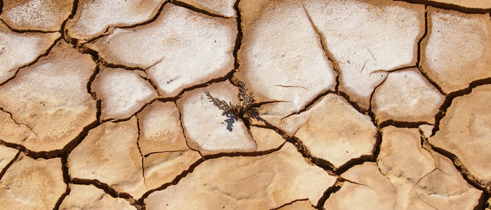

With the current global change, it is becoming increasingly important for us to be able to anticipate shifts in ecological communities. Shifts are often responsible for large, long-lasting changes and can result in dramatic ecological and economic consequences. Are there early warning signs that an ecosystem is loosing resilience?

Generic indicators, that can be quantified on the temporal and spatial dynamics of ecosystems, have been identified in the literature. In addition, for terrestrial ecosystems, it has been hypothesized that vegetation patchiness could be used as a signature of imminent transitions in ecosystems. Using both field data and modelling approaches, I investigate when and where these indicators can be quantified and when their predictions in terms of ecosystem degradation are reliable, with a current focus on arid ecosystems.

We found that the way the vegetation was spatially structured in dryland ecosystems reflected the level of stress they experienced. This suggests that this spatial structure, visible from aerial or satellite images, could be used to identify fragile and vulnerable regions, with important implications for their conservation in the current context of global change.

### CASCADE

Learn more about the [European project CASCADE](https://vimeo.com/channels/drylandshifts) (2011-2017)

### spatialwarnings

R-package on [spatial early warning signals](https://github.com/spatial-ews/spatialwarnings) (lead by A. Génin)

### Some publications:

Kéfi et al. 2024. PNAS.  
[Self-organization as a mechanism of resilience in dryland ecosystems.](https://www.pnas.org/doi/full/10.1073/pnas.2305153121). 

Génin, A. et al. 2020. Biological Conservation.  
[Mapping hotspots of potential ecosystem fragility using commonly available spatial data.](https://www.sciencedirect.com/science/article/abs/pii/S0006320719312388).

Génin, A.et al. 2018. Methods in Ecology and Evolution.  
[Monitoring ecosystem degradation using spatial data and the R package spatialwarnings.](https://besjournals.onlinelibrary.wiley.com/doi/full/10.1111/2041-210X.13058)  

Kéfi, S. and P. Couteron. 2018. Ecological indicators.  
[Spatiotemporal patterns as early warnings of possible catastrophic shifts in stressed ecological systems.](https://www.sciencedirect.com/science/article/abs/pii/S1470160X18305636).  

Berdugo, M. et al. 2017. Nature in Ecology and Evolution.  
[Plant spatial patterns identify alternative ecosystem multifunctionality states in global drylands.](https://www.nature.com/articles/s41559-016-0003)  

Schneider, F.D. and S. Kéfi. 2016. Theoretical Ecology.  
[Spatially heterogeneous pressure raises risk of catastrophic shifts.](https://link.springer.com/article/10.1007/s12080-015-0289-1)  

Kéfi, S. et al. 2014. PLoS ONE.  
[Early Warning signals of ecological transitions: Methods for spatial patterns.](https://journals.plos.org/plosone/article?id=10.1371/journal.pone.0092097).  

Kéfi, S.et al. 2013. Oikos.  
[Early warning signals also precede non-catastrophic transitions.](https://nsojournals.onlinelibrary.wiley.com/doi/abs/10.1111/j.1600-0706.2012.20838.x)  

Kéfi, S. et al. 2011. Ecology Letters.  
[Robust scaling in ecosystems and the meltdown of patch size distributions before extinction.](https://onlinelibrary.wiley.com/doi/full/10.1111/j.1461-0248.2010.01553.x)  

Kéfi, S. et al. 2007. Theoretical Population Biology.  
[Local facilitation, bistability and transitions in arid ecosystems.](https://www.sciencedirect.com/science/article/abs/pii/S0040580906001250)   

Kéfi, S. et al. 2007. Nature.  
[Spatial vegetation patterns and imminent desertification in Mediterranean arid ecosystems.](https://www.nature.com/articles/nature06111).  
