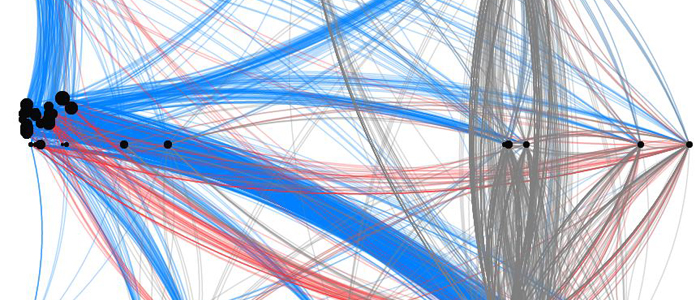

In ecological communities, interactions between species form complex networks that mediate their response to perturbations. So far, ecological network studies have typically focused on one (or a few) interaction types at a time, but data and models of webs including different interaction types simultaneously have recently become available. How and when does the diversity of interactions matter for the dynamics and resilience of ecological systems? My recent research aims at analyzing ecological networks including different types of interactions. Moving beyond unidimensional analyses of ecological networks may contribute to improving our understanding and predictive capacity of the way ecological systems respond to disturbances.

### The Chilean web

Visualize the Chilean web with [openmappr](https://map.openmappr.org/chile-marine-intertidal-network/) (by E. Berlow)

Play with the [Chilean web multiplex clusters](http://pbil.univ-lyon1.fr/software/multiplex/) (by V. Miele)

### Running dynamics of multi-interaction ecological networks

Check out the Julia package [EcologicalNetworksDynamics.jl](https://beckslab.github.io/EcologicalNetworksDynamics.jl/man/quickstart/) (lead by I. Lajaaiti and I. Bonnici)

### ECONET

Learn more about the ANR project [ECONET](https://cmatias.perso.math.cnrs.fr/ANR_EcoNet.html) (2019-2022)

### Some publications:

Dominguez-Garcia and Kéfi. 2024. PLoS Computational Biology.  
[The structure and robustness of ecological networks with two interaction types](https://journals.plos.org/ploscompbiol/article?id=10.1371/journal.pcbi.1011770). 

B Pichon, I Gounand, S Donnet, S Kéfi. 2024. Ecology.  
[The interplay of facilitation and competition drives the emergence of multistability in dryland plant communities](https://esajournals.onlinelibrary.wiley.com/doi/full/10.1002/ecy.4369). 

V Miele, C Guill, R Ramos-Jiliberto, S Kéfi. 2019. PLoS computational biology.  
[Non-trophic interactions strengthen the diversity—functioning relationship in an ecological bioenergetic network model](https://journals.plos.org/ploscompbiol/article?id=10.1371/journal.pcbi.1007269). 

S Pilosof, MA Porter, M Pascual, S Kéfi. 2017. Nature Ecology & Evolution.  
[The multilayer nature of ecological networks](https://www.nature.com/articles/s41559-017-0101). 

S Kéfi et al. 2016. PLoS biology.  
[How structured is the entangled bank? The surprisingly simple organization of multiplex ecological networks leads to increased persistence and resilience](https://journals.plos.org/plosbiology/article?id=10.1371/journal.pbio.1002527). 

S Kéfi et al. 2015. Ecology.  
[Network structure beyond food webs: mapping non‐trophic and trophic interactions on Chilean rocky shores](https://esajournals.onlinelibrary.wiley.com/doi/abs/10.1890/13-1424.1)

S Kéfi et al. 2012. Ecology letters.  
[More than a meal… integrating non‐feeding interactions into food webs](https://onlinelibrary.wiley.com/doi/full/10.1111/j.1461-0248.2011.01732.x)